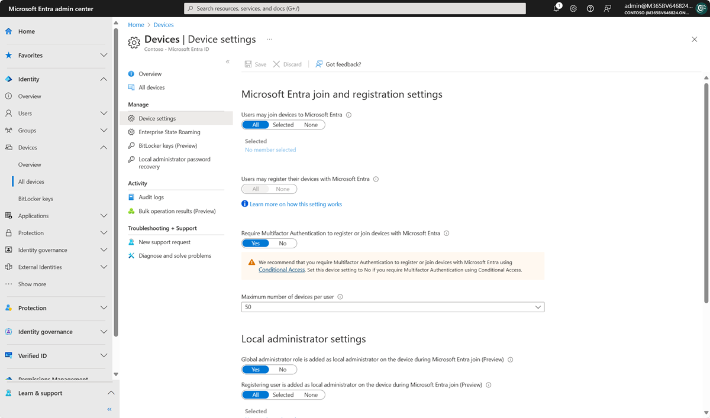

### Overview
Microsoft Entra ID provides a central place to manage device identities and monitor related event information.&nbsp;&nbsp;&nbsp;A [device identity](https://learn.microsoft.com/en-us/graph/api/resources/device) is an object in Microsoft Entra ID. This device object is similar to users, groups, or applications.&nbsp;&nbsp;&nbsp;A device identity gives administrators information they can use when making access or configuration decisions.  Device identities are a prerequisite for scenarios like [device-based Conditional Access policies](https://github.com/MicrosoftDocs/entra-docs/blob/main/docs/identity/devices/~/identity/conditional-access/concept-conditional-access-grant.md) and [Mobile Device Management with the Microsoft Intune family of products](https://github.com/MicrosoftDocs/entra-docs/blob/main/mem/endpoint-manager-overview).

#### Device Management Screens - Microsoft Entra Admin Center

<figure><figcaption>Devices Overview - Entra Admin Center</figcaption></figure><figure><figcaption>All Devices View - Entra Admin Center</figcaption></figure>

A [device identity](https://learn.microsoft.com/en-us/graph/api/resources/device) is an object in Microsoft Entra ID:
- Analagous to user, group, or application objects
- Provides administrators with details to inform access or configuration decisions, for example, when defining and applying [Conditional Access policies](https://learn.microsoft.com/en-us/entra/identity/conditional-access/concept-conditional-access-grant)
- Is a prerequisite for scenarios like [device-based Conditional Access policies](https://learn.microsoft.com/en-us/entra/identity/conditional-access/concept-conditional-access-grant) and [Mobile Device Management with the Microsoft Intune family of products](https://learn.microsoft.com/en-us/mem/endpoint-manager-overview).
- Can facilitate SSO access to Azure-based and [on-prem resources](https://learn.microsoft.com/en-us/entra/identity/devices/device-sso-to-on-premises-resources)

 

Devices obtain their Entra Device Identity through user self-service or through a controlled process managed by administrators, by any of the following three methods:

 

<figure><figcaption>Entra Registration</figcaption></figure>
<a href="https://learn.microsoft.com/en-us/entra/identity/devices/concept-device-registration">Microsoft Entra Registration</a>
Device is <b>registered</b> to Microsoft Entra ID <b>without requiring organizational account to sign in to the device</b><ul><li>Best suited for mobile devices such as phones and tablets</li><li>Also suitable for BYOD arrangements</li></ul><figure><figcaption>Entra Join</figcaption></figure>
<a href="https://learn.microsoft.com/en-us/entra/identity/devices/concept-directory-join">Microsoft Entra Join</a>
Device is <b>joined</b> only to Microsoft Entra ID and <i>requires an organizational account to sign in to the device</i><ul><li>For Windows10+ devices, owned by your organization</li><li>Also for instances of <a href="https://learn.microsoft.com/en-us/entra/identity/devices/howto-vm-sign-in-azure-ad-windows">Windows Server 2019+ running as VMs in your organization's Azure instance</a></li></ul><figure><figcaption>Entra Hybrid Join</figcaption></figure>
<a href="https://learn.microsoft.com/en-us/entra/identity/devices/concept-hybrid-join">Microsoft Entra Hybrid Join</a>
Device is <b>joined</b> to on-prem Active Directory <i>and to</i> Microsoft Entra ID, <i>requiring an organizational account to sign into the device</i><ul><li>An interim step on the path to full Entra join</li></ul>

:::tip[Did you know?]
- All three device ID methods can coexist within an organization
- Devices ID'd by any of these methods can coexist within an organization
:::

 
 
 
 

#### Device Enrollment
Device enrollment, which is separate from Entra-registered, grants additional levels of control to the , which must be enabled by an Administrator.  

#### Configure device settings
If you want to manage device identities by using the Microsoft Entra admin center, the devices need to be either [registered or joined](https://learn.microsoft.com/en-us/entra/identity/devices/overview) to Microsoft Entra ID. As an administrator, you can control the process of registering and joining devices by configuring the following device settings.
You must be assigned one of the following roles to read or modify device settings:

- [Cloud Device Administrator](https://learn.microsoft.com/en-us/entra/identity/role-based-access-control/permissions-reference#cloud-device-administrator) (read and modify)
- [Intune Administrator](https://learn.microsoft.com/en-us/entra/identity/role-based-access-control/permissions-reference#intune-administrator) (read only)
- [Windows 365 Administrator](https://learn.microsoft.com/en-us/entra/identity/role-based-access-control/permissions-reference#windows-365-administrator) (read only)

<!--  -->

<figure><figcaption>Entra Device Settings Screen</figcaption></figure>

- **Users may join devices to Microsoft Entra ID:** This setting enables you to select the users who can register their devices as Microsoft Entra joined devices. The default is All.

:::note
The **Users may join devices to Microsoft Entra ID** setting is applicable only to Microsoft Entra join on Windows 10 or newer. This setting doesn't apply to Microsoft Entra hybrid joined devices, [Microsoft Entra joined VMs in Azure](https://learn.microsoft.com/en-us/entra/identity/devices/howto-vm-sign-in-azure-ad-windows#enable-azure-ad-login-for-a-windows-vm-in-azure), or Microsoft Entra joined devices that use [Windows Autopilot self-deployment mode](https://learn.microsoft.com/en-us/autopilot/self-deploying) because these methods work in a userless context.
:::

- **Users may register their devices with Microsoft Entra ID:** You need to configure this setting to allow users to register Windows 10 or newer personal, iOS, Android, and macOS devices with Microsoft Entra ID. If you select **None**, devices aren't allowed to register with Microsoft Entra ID. Enrollment with Microsoft Intune or mobile device management for Microsoft 365 requires registration. If you've configured either of these services, **ALL** is selected, and **NONE** is unavailable.

- **Require multifactor authentication to register or join devices with Microsoft Entra ID:**
    - We recommend organizations use the [Register or join devices user action](https://learn.microsoft.com/en-us/entra/identity/conditional-access/concept-conditional-access-cloud-apps#user-actions) in Conditional Access to enforce multifactor authentication. You must configure this toggle to **No** if you use a [Conditional Access policy to require multifactor authentication](https://learn.microsoft.com/en-us/entra/identity/conditional-access/how-to-policy-mfa-device-register-join).
    - This setting allows you to specify whether users are required to provide another authentication factor to join or register their devices to Microsoft Entra ID. The default is **No**. We recommend that you require multifactor authentication when a device is registered or joined. Before you enable multifactor authentication for this service, you must ensure that multifactor authentication is configured for users that register their devices. For more information on Microsoft Entra multifactor authentication services, see [getting started with Microsoft Entra multifactor authentication](https://learn.microsoft.com/en-us/entra/identity/authentication/concept-mfa-howitworks). This setting might not work with third-party identity providers.

:::note
The Require multifactor authentication to register or join devices with Microsoft Entra ID setting applies to devices that are either Microsoft Entra joined (with some exceptions) or Microsoft Entra registered. This setting doesn't apply to Microsoft Entra hybrid joined devices, [Microsoft Entra joined VMs in Azure](https://learn.microsoft.com/en-us/entra/identity/devices/howto-vm-sign-in-azure-ad-windows#enable-azure-ad-login-for-a-windows-vm-in-azure), or [Microsoft Entra joined devices that use Windows Autopilot self-deployment mode](https://learn.microsoft.com/en-us/autopilot/self-deploying).
:::

- **Maximum number of devices:** This setting enables you to select the maximum number of Microsoft Entra joined or Microsoft Entra registered devices that a user can have in Microsoft Entra ID. If users reach this limit, they can't add more devices until one or more of the existing devices are removed. The default value is **50**. You can increase the value up to 100. If you enter a value above 100, Microsoft Entra ID sets it to 100. You can also use **Unlimited** to enforce no limit other than existing quota limits.

:::note
The **Maximum number of devices** setting applies to devices that are either Microsoft Entra joined or Microsoft Entra registered. This setting doesn't apply to Microsoft Entra hybrid joined devices.
:::

- **Manage Additional local administrators on Microsoft Entra joined devices:** This setting allows you to select the users who are granted local administrator rights on a device. These users are added to the Device Administrators role in Microsoft Entra ID.

- **Enable Microsoft Entra Local Administrator Password Solution (LAPS) (preview):** LAPS is the management of local account passwords on Windows devices. LAPS provides a solution to securely manage and retrieve the built-in local admin password. With cloud version of LAPS, customers can enable storing and rotation of local admin passwords for both Microsoft Entra ID and Microsoft Entra hybrid join devices. To learn how to manage LAPS in Microsoft Entra ID, see [the overview article](https://learn.microsoft.com/en-us/entra/identity/devices/howto-manage-local-admin-passwords).

- **Restrict non-admin users from recovering the BitLocker key(s) for their owned devices:** Admins can block self-service BitLocker key access to the registered owner of the device. Default users without the BitLocker read permission are unable to view or copy their BitLocker key(s) for their owned devices. You must be at least a [Privileged Role Administrator](https://learn.microsoft.com/en-us/entra/identity/role-based-access-control/permissions-reference#privileged-role-administrator) to update this setting.

- **Enterprise State Roaming:** For information about this setting, see [the overview article](https://learn.microsoft.com/en-us/entra/identity/devices/enterprise-state-roaming-enable).

### References
[Entra Devices - Configure Device Settings](https://learn.microsoft.com/en-us/entra/identity/devices/manage-device-identities#configure-device-settings)

