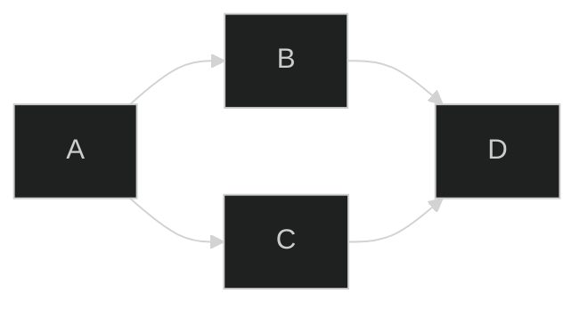

    

        ## [AWS Organizations](https://docs.aws.amazon.com/organizations/latest/userguide/orgs_introduction.html)
    

    <section class="l2">
        ## Title 2
        Title2 Text Block
        <section class="l3">
            ### Title 3
            Title3 Text Block
            <section class="l4">
                #### Title 4
                Title4 Text Block
                <section class="l5">
                    ##### Title 5
                    Title5 Text Block
                </section>
            </section>
        </section>
    </section>

## Markdown *in* `summary`

Hi.

<h2 id="a-heros-welcome" style="display: inline;">A Hero's Welcome</h2>
<a class="anchor-link" href="#a-heros-welcome"><svg width="16" height="16" viewBox="0 0 24 24"><path fill="currentcolor" d="m12.11 15.39-3.88 3.88a2.52 2.52 0 0 1-3.5 0 2.47 2.47 0 0 1 0-3.5l3.88-3.88a1 1 0 0 0-1.42-1.42l-3.88 3.89a4.48 4.48 0 0 0 6.33 6.33l3.89-3.88a1 1 0 1 0-1.42-1.42Zm8.58-12.08a4.49 4.49 0 0 0-6.33 0l-3.89 3.88a1 1 0 0 0 1.42 1.42l3.88-3.88a2.52 2.52 0 0 1 3.5 0 2.47 2.47 0 0 1 0 3.5l-3.88 3.88a1 1 0 1 0 1.42 1.42l3.88-3.89a4.49 4.49 0 0 0 0-6.33ZM8.83 15.17a1 1 0 0 0 1.1.22 1 1 0 0 0 .32-.22l4.92-4.92a1 1 0 0 0-1.42-1.42l-4.92 4.92a1 1 0 0 0 0 1.42Z"></path></svg>Section titled A Hero's Welcome</a>

Body text

## Another Welcome

Body text

<article class="a">
<header>
## Unsung heros
</header>
<section>
Consider the following alternatives to the `

Dropdown Title
Body content and text
` combination of elements:
- `<article><header></header><section></section></article>`
</section>
</article>

<article class="b">
    <header class="tab">
        <input type="checkbox" name="accordion-1" id="cb1" />
        <label for="cb1" class="tab__label">
        ## Unsung heros
        </label>
    </header>
    <section class="tab__content">
        Consider the following alternatives to the `

Dropdown Title
Body content and text
` combination of elements:
        - `<article><header></header><section></section></article>`
    </section>
</article>

<article id="accordion">
    <input type="checkbox" id="check-1" />
    <label for="check-1">
    ## Option 1
    </label>
    <section>
        
Lorem ipsum dolor sit amet, consectetur adipisicing elit. A, odit, quia hic ipsam laboriosam dignissimos suscipit eligendi! Aspernatur, ad, suscipit officiis repellat consequuntur quod quibusdam sint nobis magnam voluptates veritatis?

        
Lorem ipsum dolor sit amet, consectetur adipisicing elit. A, odit, quia hic ipsam laboriosam dignissimos suscipit eligendi! Aspernatur, ad, suscipit officiis repellat consequuntur quod quibusdam sint nobis magnam voluptates veritatis?

        
Lorem ipsum dolor sit amet, consectetur adipisicing elit. A, odit, quia hic ipsam laboriosam dignissimos suscipit eligendi! Aspernatur, ad, suscipit officiis repellat consequuntur quod quibusdam sint nobis magnam voluptates veritatis?

    </section>
</article>